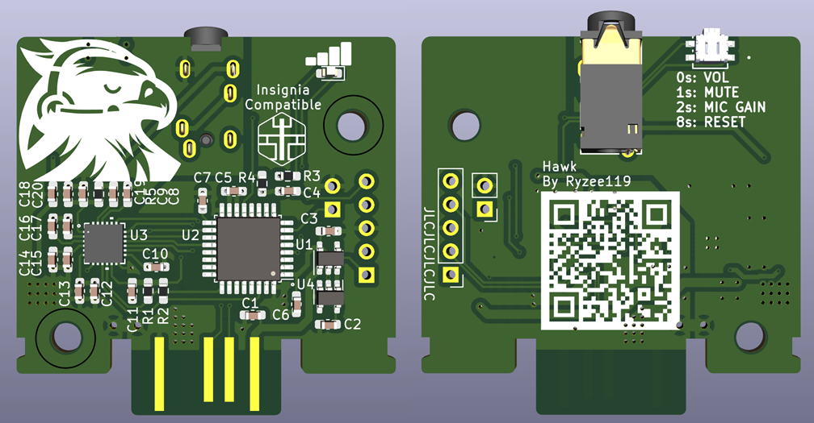

## Hawk - Open Source Xbox Live Communicator

This project is an open source replacement of the [Microsoft Xbox Live Communicator](https://xbox.fandom.com/wiki/Xbox_LIVE_Headset) utilizing modern components and custom open-source firmware.

It provides feature parity with the original communicator with the following differences:
* A 3.5mm TRRS jack is used to support more generic headsets. (Stereo headsets will output as mono.)
* The volume wheel is replaced with a button. Volume is indicated by LED brightness.

### Usage
* When installing Hawk into your controller, it must be installed in the slot closest to you.
* Press the button to increment the volume. Once maximum volume is reached, it will cycle back to zero.
* Hold the button for 1 second to mute and disable the microphone input (LED will flash at 1Hz).
* Hold the button 2 seconds to enter microphone gain adjustment mode (LED will flash at 4Hz).
* Volume and microphone gain adjustments will be saved internally. You can reset these to default by holding the button down for 8 seconds.

### Assembly
* See [Kitspace](https://master.staging.kitspace.dev/Ryzee119/hawk) for BOM, PCB ordering and assembly information.
* See [KiCanvas](https://kicanvas.org/?github=https%3A%2F%2Fgithub.com%2FRyzee119%2Fhawk%2Ftree%2Fmaster%2Fhardware) for schematic view.

### Compilation
* Download and install [Visual Studio Code](https://code.visualstudio.com/).
* Install the [PlatformIO IDE](https://platformio.org/platformio-ide) plugin.
* In Visual Studio Code File > Open Folder... > hawk
* Hit build on the Platform IO toolbar (✓).

### Programming
* USB DFU. Connect xbox controller to your PCB, then hold the Hawk button down while inserting it into the controller to enter DFU mode. Program with [STM32Cubeprogrammer](https://www.st.com/en/development-tools/stm32cubeprog.html)
* ST-Link interface (5 pin header available on PCB)

### Attribution
* [Board outline](https://github.com/Zeigren/OXC)
* [EEPROM emulation code](https://github.com/nimaltd/ee)
